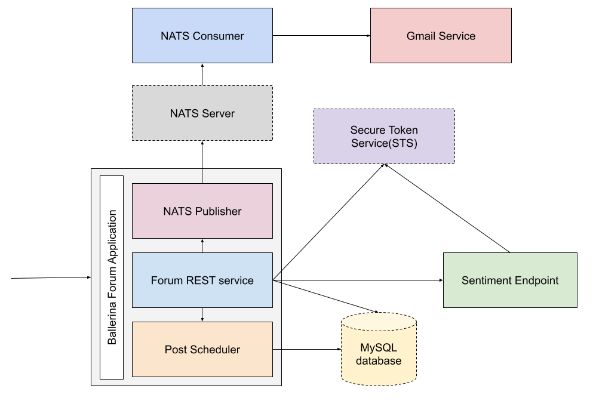
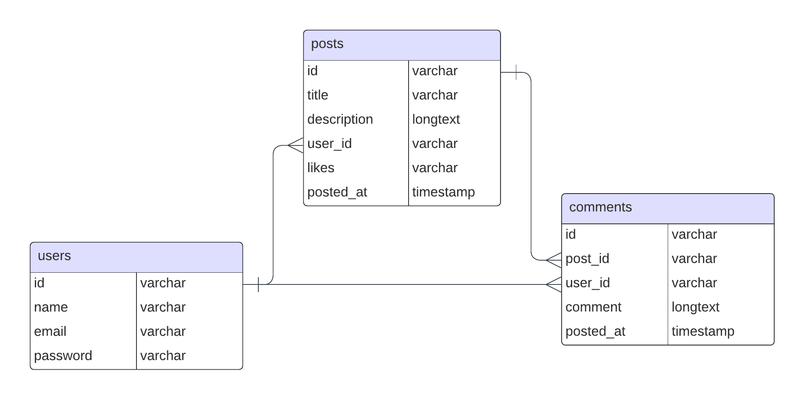

# Integration Basics with Ballerina

## Training Objective

Cover basic concepts related to integration. Following sessions will cover different topics deeply.

## Areas Covered

- Installing and Managing distributions
- Writing a simple RESTful service
- Accessing database
- Data transformation with data mapper
- HTTP client
- Service/Client security with SSL/MTLS
- Security - OAuth2
- Resiliency
- Building Docker images

## Prerequisites

- Install the latest version of Ballerina
- Set up VS code by installing the Ballerina extension
- Install Docker

## Scenario

The scenario is based on a simple API written for a forum site, which has users, associated posts and comments. Following depicts the high level component diagram:

The forum REST service exposes the following resources:

| Resource                       | Description                            |
|--------------------------------|----------------------------------------|
| `POST api/users`               | Create a new user                      |
| `POST api/login`               | Login as with user credentials         |
| `POST api/users/{id}/posts`    | Create a new forum post                |
| `GET api/posts`                | Get all the forum posts                |
| `GET api/posts/{id}`           | Get the forum post specified by the id |
| `POST api/posts/{id}/likes`    | Like a forum post                      |
| `POST api/posts/{id}/comments` | Comment on a post                      |

> **Note:** The service should be started in port **4000** to test with the frontend application.

For testing, the MySQL database can be started using the docker-compose. The database is configured with the following properties:

| Property | Value          |
|----------|----------------|
| Host     | localhost      |
| Port     | 3306           |
| Username | forum_user     |
| Password | dummypassword  |
| Database | forum_database |

Following is the entity relationship diagram:

## Task 5 - Deploy and test the services using Docker

Build the docker images for the `bal-forum` and the `sentiment-api` services and run them using docker compose. The docker compose file is available in the `backend` directory.

> **Tip:** Refer to the [Ballerina Code to Cloud guide](https://ballerina.io/learn/code-to-cloud-deployment/) for more information on deploying Ballerina services as docker images.
